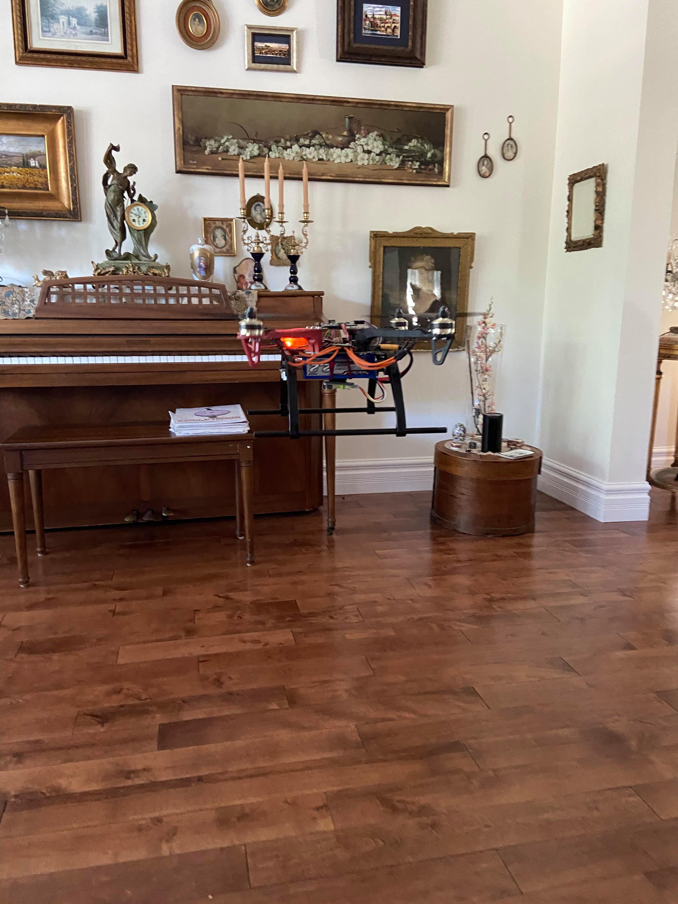
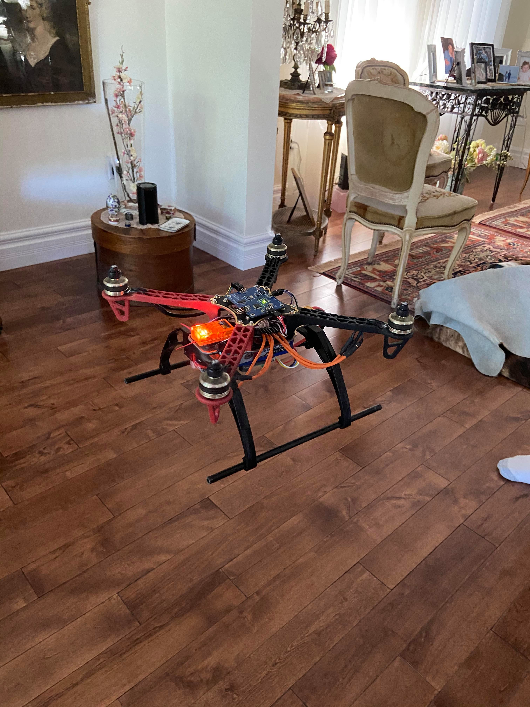
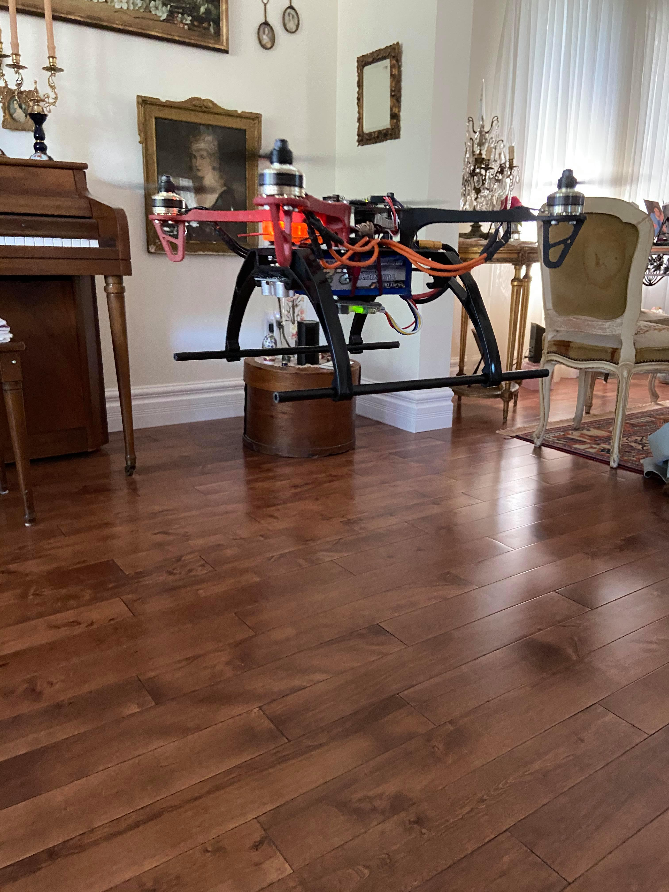

# AAQuad-Evolution
---

The AAQuad-Evolution is a flight computer I've designed to control a quadcopter. The computer takes care of continued stabilization in flight while leaving the pilot free to command roll, pitch, and yaw angles as well as altitude. The project is made up of a custom PCB, all the bare-metal C code that runs on the Atmega328pb processor and Matlab simulations used to design and tune the PID algorithms. This is very much a bare bones flight computer that is in no way as feature rich as BetaFlight or any of the other famous FOS flight controllers. Its advantage lies in its simplicity. Anyone with some understanding of the dynamics of flight, calculus, and circuitry could begin to understand the project without being faced with a mountain of complexity and no idea where to start. In the end, the AAQuad-Evolution continues to satisfy my curiosity for flight and increase my understanding of embedded systems all the while providing me with a creative outlet to try out all kinds of cool things.

## Flying the Quad
---

The commands are as such:

* Increasing/decreasing the throttle stick corresponds to an increase/decrease in the target altitude.
* Increasing/decreasing the rudder stick corresponds to an increase/decrease in the target azimuth (relative to the starting azimuth).
* Increasing/decreasing the aileron stick corresponds to an increase/decrease in the target bank angle.
* Increasing/decreasing the elevator stick corresponds to an increase/decrease in the target pitch angle.

The ranges for all the mentioned targets are defined in src/Pid.h.

## Calibrating the Quad
---

1. Before plugging in the battery, turn the transmitter on and put the throttle stick to full power.
2. Plug in the battery.
	* A solid green led will turn on, indicating calibration mode has been successfully entered.
3. Position the Quad on a level surface and make sure it is completely still.
4. Put the throttle stick to 0.
	* The led will turn off, indicating calibration has begun.
5. Once the led turns on again, the Quad has been successfully calibrated and is ready to be flown.

### Some in flight images

### Some close ups

## What's going on ?
---

So you want to understand how the AAQuad flies ? Great! Here is a high level explanation of what's going on.

Everything starts in main.c, which you'll find in the root directory of the project. If you go through that file, you'll find it's incredibly simple in principle. Here, we begin with a short delay to ensure all electrical systems have stabilized after power up. Next, we execute a calibration and finally, we call the controller state machine inside an infinite loop (this is where the magic happens).

Now, let's head into the src directory. Apart from main.c, this is where all the the source and header files are stored. Take a look at the state machine in Controller.c (the switch case statement inside the Controller_DoYourThingAndFlyTheQuadITrustYou function). The switch statement is organized in the order that the states get executed. Here's what's going on:

1. GetPilotInstructions: We check to see whether there are any new instructions from the receiver. If you take a look inside the PilotInstructions module, you'll see that the pwm signals sent from the ESC are read asynchronously via external and pin change interrupts. Those instructions get translated into percentages for commanded roll, pitch, yaw and altitude. If they are ready when PilotInstructions_ComputePilotResult is called, we pick them up. Otherwise, we just move on and pick them up the next time.

2. GetImuData: We collect the accelerometer, gyroscope and magnetometer data from the inertial measurement unit. This is also an interrupt based exchanged so when we call Imu_GetResult, we are just checking if the data is ready and picking it up if it is.

3. GetAltitude: We collect data from the ultrasonic distance sensor. Once again, it is an interrupt based exchange, so we are just checking and picking data up if it is ready.

4. TriggerNewMeasurements: Now that we've collected all the data of interest, we need to instruct the sensors to collect more data for us. This way, when the time comes once again to ask for it, it will be ready. For the IMU, this triggers an interrupt based SPI exchange that reads the registers that contain the relevant data. For the ultrasonic distance sensor, this sends the digital pulse instructing it to collect a new measurement.

5. FuseMeasurements: While the sensors do their thing, we begin to crunch the math. In this state, we fuse gyroscope and accelerometer data together using a Mahony filter. This filter returns the estimated orientation of the quad encoded in a quaternion.

6. ConvertToEuler: Since quaternions are very non linear and thus hard to use in a linear controller, we convert them into Euler angles. These are the familiar roll, pitch and yaw angles. At the same time, we also compute the derivatives of the Euler angles (representative of the angular velocity of the quad in every axis). This is for future use in the controller. It is done this way because computing a derivative from the change in measured angular positions leaves us very susceptible to noise. Since we have a gyroscope and measure the derivatives directly, we can use those values and avoid this problem.

7. ComputePid: Now that we know what the pilot wants and what the quad is doing, we can compute what we need the motors to do to achieve the pilot's intentions. This is done via multiple PID (proportional, integral, derivative) algorithms. This module also takes care of figuring out the takeoff sequence of the quad. What we get from it is an array of 4 floats that correspond to percentages of full power that need to be delivered to each motor to achieve the desired intentions.

8. SendToPwm: Once we know what we want the motors to do, we need to communicate that to them. To do so, we begin an interrupt based I2C exchange with a chip responsible for sending out PWM to the ESC.

9. WaitForTimer: Last, to keep things synchronous, we sit in this state until a timer says some set time has passed. Once that is the case, we go back to the GetPilotInstructions state and the cycle begins anew.

10. Failed: This state should never be reached in normal flight but exists in case a catastrophic failure needs to be handled. In the case that something goes horribly wrong in one of the modules (for example communication gets cut with one of our chips), we go to this state and the PWM output to the ESC gets immediately shutdown, causing the motors to stop spinning.

## Building it for yourself
---

A word of caution. This project was not designed to be reproduced, so it is fairly difficult to do so. That being said, if anyone does want to construct the PCB and tune then upload the software, here is what they would need to do:

### Prereq Hardware

* [Avr-Ice Jtag programmer](https://www.digikey.ca/en/product-highlight/a/atmel/atmel-ice-programmer-debugger?utm_adgroup=&utm_source=google&utm_medium=cpc&utm_campaign=Dynamic%20Search_EN_RLSA&utm_term=&productid=&gclid=Cj0KCQjw-r71BRDuARIsAB7i_QPVjor9MwRzLKq1k-X_j-4Pasl5VIqnCOX7berqcM59qXUvdlT64RQaAkUuEALw_wcB)
* A 4 channel ESC with 5V BEC that can handle 200 Hz PWM refresh rates
* A minimum 4 channel receiver that communicates over PWM
* Your favorite quadcopter frame, motors, and battery
* A transmitter capable of communicating with your esc of choice

### Prereq Software

* Atmel studio 7+
* Kicad 5+ (Optional, as the gerbers are already in the repo)
* Simulink 2019+, equipped with the aerospace blockset

### Building the PCB

Full gerber files and a BOM are present in the PCB/KicadFiles directory.
The only sensor not present in the BOM is the [ultrasonic distance sensor](https://www.sparkfun.com/products/15569).
You will also need to purchase the appropriate wires to connect the ESC, receiver, and ultrasonic sensor to the PCB.

### Adjusting the PID gains

If you know the mass, inertia tensor, and relationship between throttle percentage, force and torque of your quadcopter, you can adjust the appropriate blocks in the Simulink model and tune the PID gains. You can insert those gains into src/Pid.c.

### Compiling and uploading the software

Once the pcb is built, power it by connecting the ESC to the battery and plug in the Jtag programmer to the appropriate pins. To open the project in Atmel studio, open the project file present in /build. Then, click the compile button and the run button.

## License

This project is under the MIT license.

## Acknowledgements

* SOH Madgwick, whose implementation of the Mahony filter is used in this project.
* A shoutout to Anny Wang, who said: "Hey, wouldn't it be cool to build a quadcopter ?" back in 2018, which is how this project began :p.
