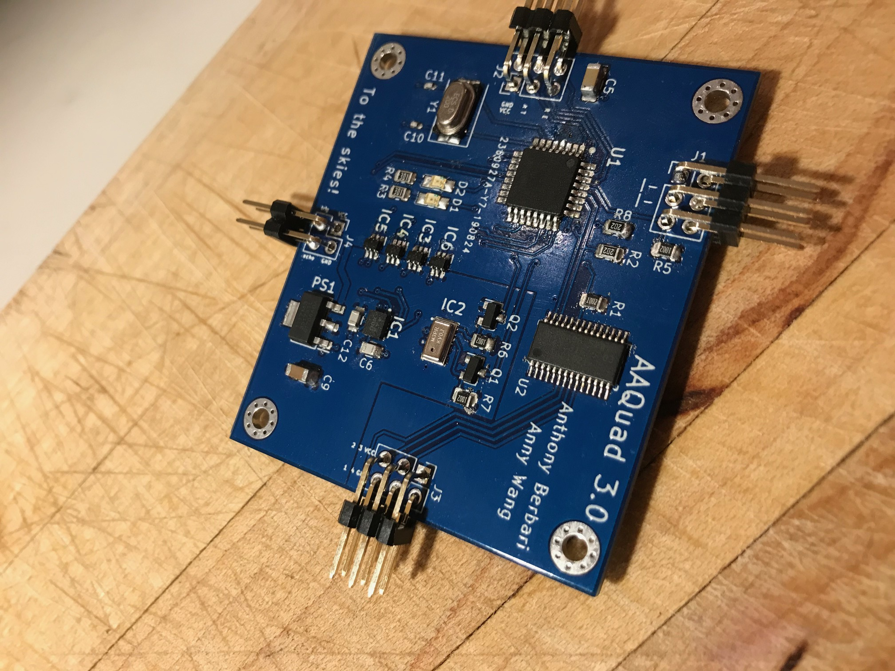
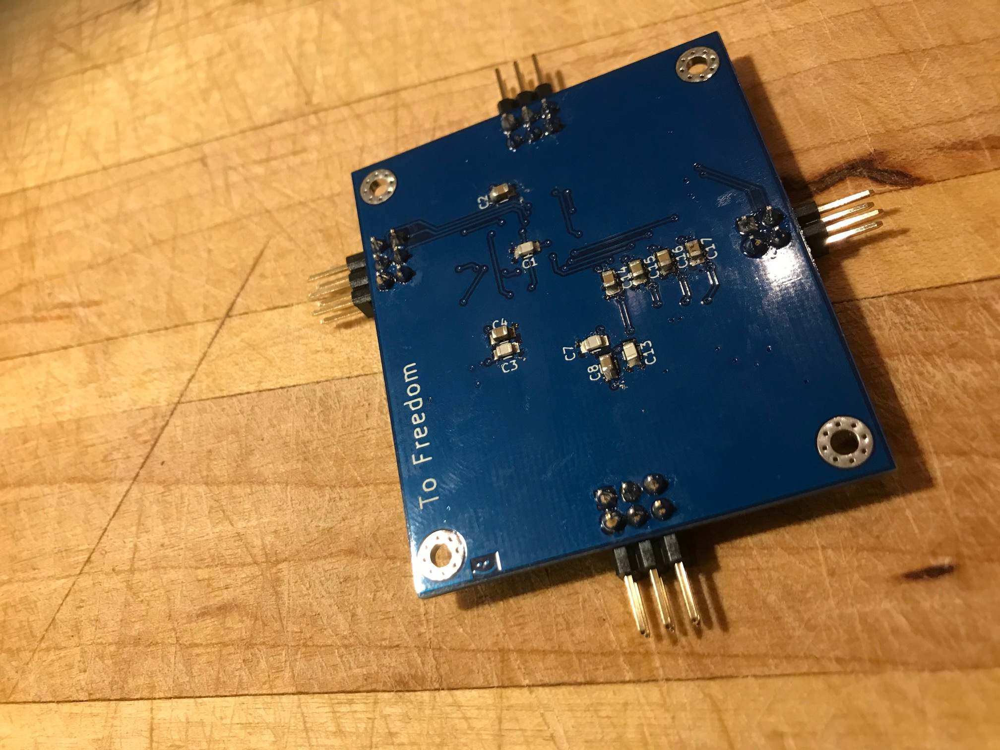
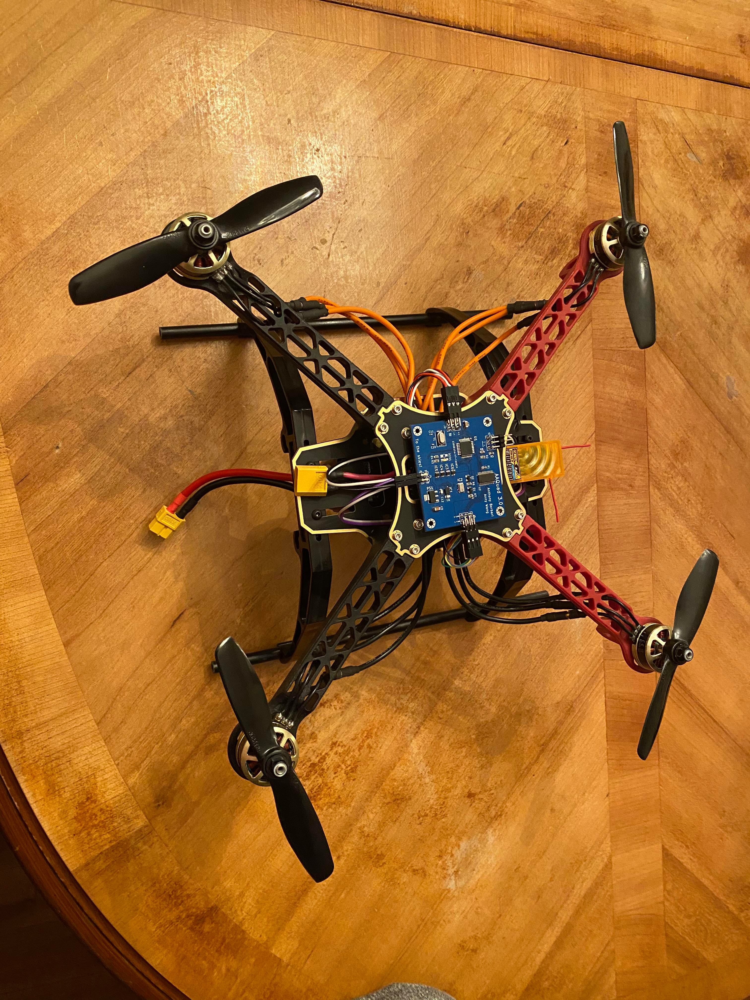
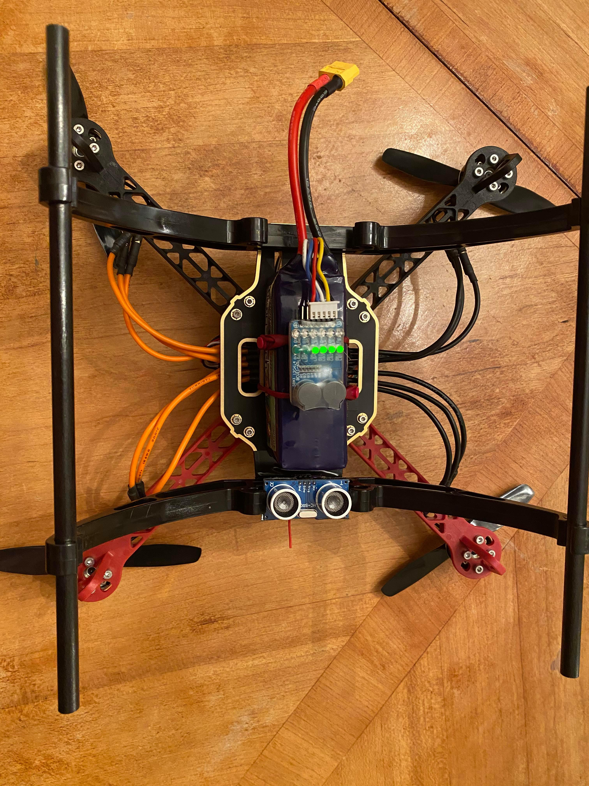
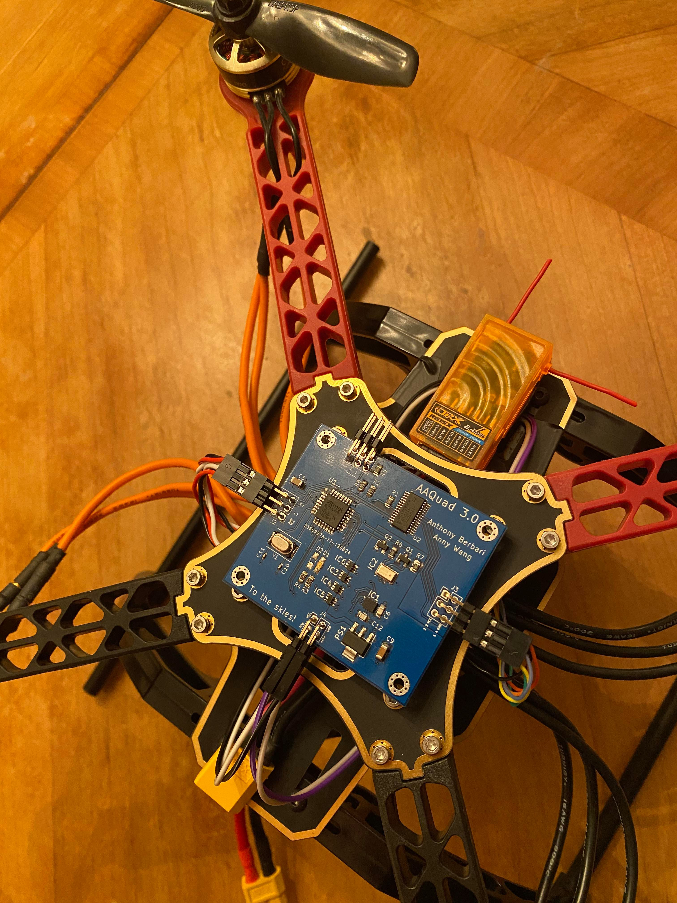
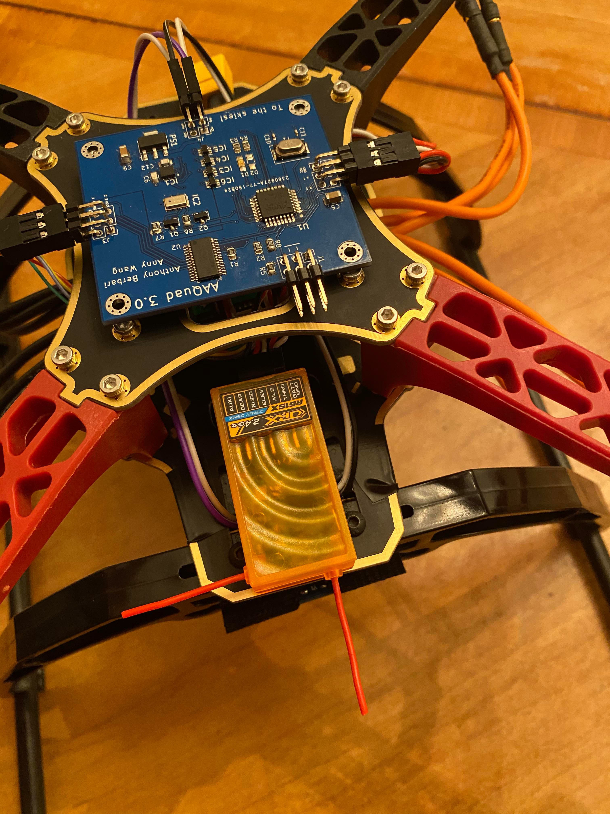

# AAQuad-Evolution
---

The AAQuad-Evolution is a flight computer I've designed to control a quadcopter. The computer takes care of continued stabilization in flight while leaving the pilot free to command roll, pitch, and yaw angles aswell as altitude. The project is made up of a custom PCB, all the bare-metal C code that runs on the Atmega328pb processor and Matlab simulations used to design and tune the PID algorithms. This is very much a bare bones flight computer that is in no way as feature rich as BetaFlight or any of the other famous FOS flight controllers. Its advantage lies in its simplicity. Anyone with a slight understanding of the dynamics of flight, the C language, and some circuitry could understand the entirety of the project. In the end, the AAQuad-Evolution continues to satisfy my curiosity for flight and increase my understanding of embedded systems all the while providing me with a creative outlet to try out all kinds of cool things.

## Flying the Quad
---

The commands are as such:

* Increasing/decreasing the throttle stick corresponds to an increase/decrease in the target altitude.
* Increasing/decreasing the rudder stick corresponds to an increase/decrease in the target azimuth (relative to the starting azimuth).
* Increasing/decreasing the aileron stick corresponds to an increase/decrease in the target bank angle.
* Increasing/decreasing the elevator stick corresponds to an increase/decrease in the target pitch angle.

The ranges for all the mentioned targets are defined in src/Pid.h.

## Calibrating the Quad
---

1. Before plugging in the battery, tun the transmitter on and put the throttle stick to full power.
2. Plug in the battery.
	* A solid green led will turn on, indicating calibration mode has been successfully entered.
3. Position the Quad on a level surface and make sure it is completely still.
4. Put the throttle stick to 0.
	* The led will turn off, indicating calibration has begun.
5. After a few seconds, you will notice the led begins flashing fairly slowly. Once you see this, rotate the quad (in the z axis) counter clockwise. Keep rotating until the led turns off.
6. Once the led turns on again, the Quad has been successfully calibrated and is ready to be flown.

### Some Pictures

## Building it for yourself
---

A word of caution. This project was not designed to be reproduced, so it is fairly difficult to do so. That being said, if anyone does want to construct the PCB and tune then upload the software, here is what they would need to do:

### Prereq Hardware

* [Avr-Ice Jtag programmer](https://www.digikey.ca/en/product-highlight/a/atmel/atmel-ice-programmer-debugger?utm_adgroup=&utm_source=google&utm_medium=cpc&utm_campaign=Dynamic%20Search_EN_RLSA&utm_term=&productid=&gclid=Cj0KCQjw-r71BRDuARIsAB7i_QPVjor9MwRzLKq1k-X_j-4Pasl5VIqnCOX7berqcM59qXUvdlT64RQaAkUuEALw_wcB)
* A 4 channel ESC with 5V BEC that can handle 200 Hz PWM refresh rates
* A minimum 4 channel receiver that communicates over PWM
* Your favorite quadcopter frame, motors, and battery
* A transmitter capable of communicating with your esc of choice

### Prereq Software

* Atmel studio 7+
* Kicad 5+ (Optional, as the gerbers are already in the repo)
* Simulink 2019+, equipped with the aerospace blockset

### Building the PCB

Full gerber files and a BOM are present in the PCB/KicadFiles directory.
The only sensor not present in the BOM is the [ultrasonic distance sensor](https://www.sparkfun.com/products/15569).
You will also need to purchase the appropriate wires to connect the ESC, receiver, and ultrasonic sensor to the PCB.

### Adjusting the PID gains

If you know the mass, inertia tensor, and relationship between throttle percentage, force and torque of your quadcopter, you can adjust the appropriate blocks in the Simulink model and tune the PID gains. You can insert those gains into src/Pid.c.

### Compiling and uploading the software

Once the pcb is built, power it by connecting the ESC to the battery and plug in the Jtag programmer to the appropriate pins. To open the project in Atmel studio, open the project file present in /build. Then, click the compile button and the run button.

## License

This project is under the GNU General Public License v3.0

## Acknowledgements

* SOH Madgwick, whose implementation of the Mahony filter is used in this project.
* A shoutout to Anny Wang, who said: "Hey, wouldn't it be cool to build a quadcopter ?" back in 2018, which is how this project began :p.
